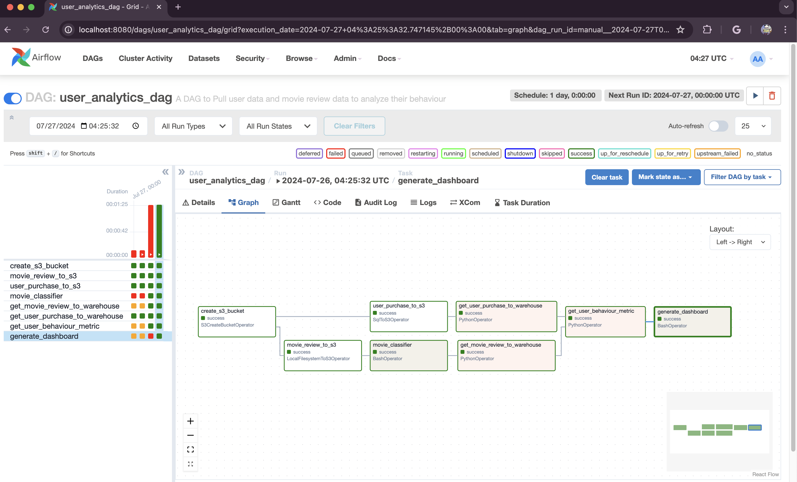
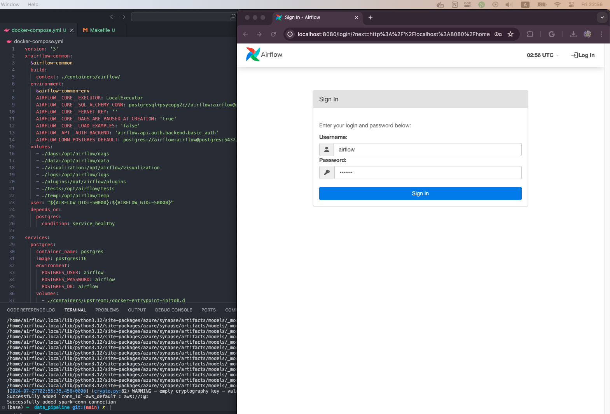
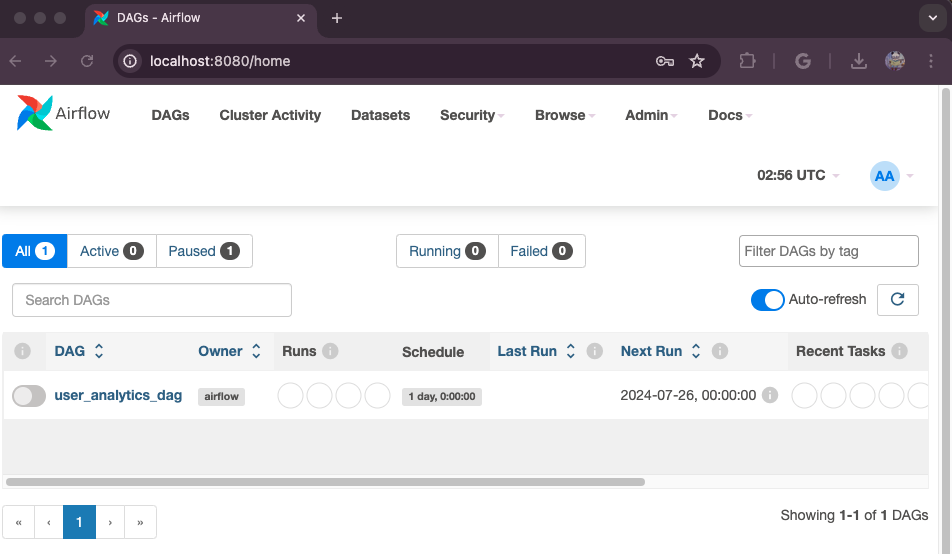
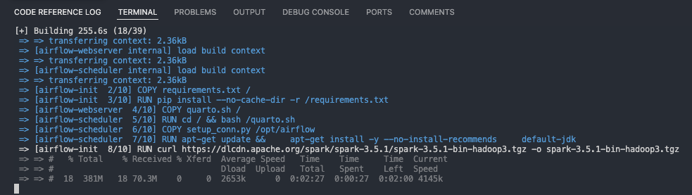
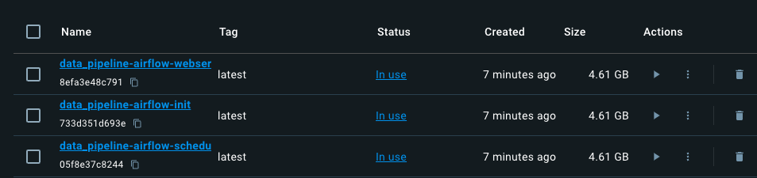
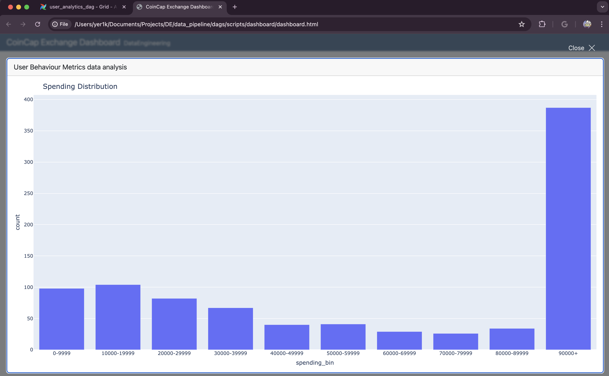

# End-to-End Data Pipeline

This repository contains the code for an end-to-end Arpache Airflow data pipeline with Docker container which extracts data from both csv and Postgres database into S3 buckets; then processes the data using Apache Spark and loads the data into bucktets. Then utilizes python scripts to analyze and build User Behaviour Metric and stores it in DuckDB. Finally the data visualization is done using Quatro and Plotly.

## Screenshots

### Airflow Running DAG

### Airflow running with Docker

#### Docker

### Interactive Dashboard with Quatro and Plotly

You can view the dashboard html rendered file [here](./dags/scripts/dashboard/dashboard.html)

